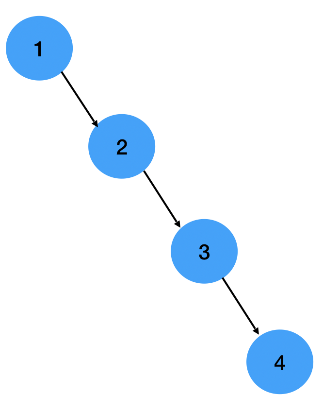
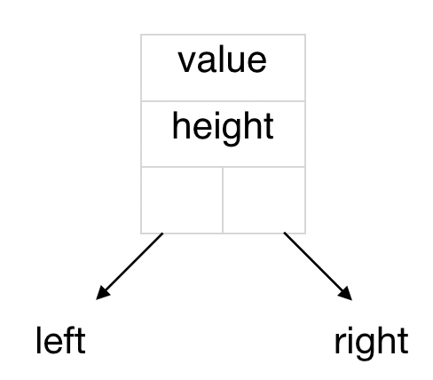
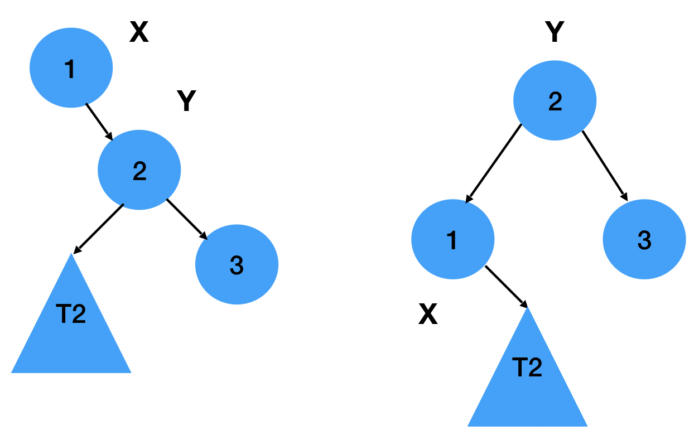
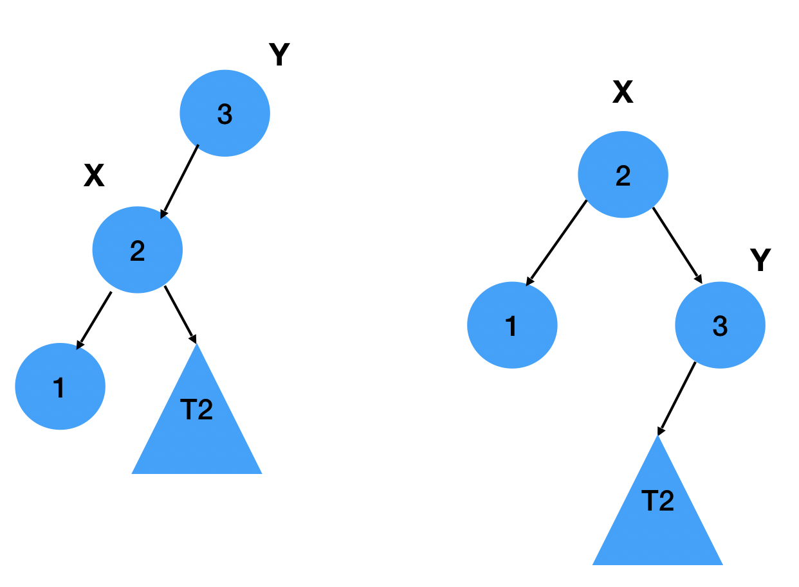

# AVL Trees

## Introduction

Consider the case when the following values are inserted in order into a Binary Search Tree : 1, 2, 3, 4
This would generate a skewed BST as follows :

Such a tree is not desirable since the complexities of all operations become Linear 

| Operation     |  Cool  |
| ------------- | -----: |
|     Search    |  O(n)  |
|     Insert    |  O(n)  |
|     Delete    |  O(n)  |

Hence AVL Trees are used. AVL Trees are self-balancing Binary Search Trees that balance the height of the tree after any insertion or deletion.

## Properties of AVL Trees

1. -1 ≤ h^R - h^L ≤ 1
	where h^R is the height of the right subtree and h^L is the height of the left subtree
The height of the left and right subtrees differ by no more than 1

2. The expression h^R - h^L is known as the Balance Factor, which can take only the values {-1, 0, 1}

(source : Wikipedia https://en.wikipedia.org/wiki/AVL_tree) shows how AVL Trees balance their height.

## Applications

Though AVL Trees where the first self-balancing data structure to be invented after which data structures with fewer rotations like Red Black Trees where invented, AVL Trees are still used in a lot of places. 

They are used in NoSQL databases as they take less time for large number of updates. AVL Trees have also combined with B-Trees to create a new data structure called T-Tree which is used in popular NoSQL databases.
For more interesting information and visuals, refer https://pandorafms.com/blog/nosql-databases-the-definitive-guide/

## Complexities

| Operation        | Are           | Cool  |
| ------------- |:-------------:| -----:|
| Search     | O(n) | O(Log n)  |
| Insert      | O(Log n)      |   O(Log n) |
| Delete | O(Log n)     |    O(Log n) |

Space complexity is O(n)

There is an interesting proof as to why the complexities are always O(n) in https://en.wikipedia.org/wiki/AVL_tree#Properties

## Node Structure

Every node in an AVL tree contains 4 attributes represented in the diagram below :

## Rotations

Before understanding the basic operations of an AVL Tree, you need to know how rotations (fundamental properties of AVL Trees) work :

The diagrams below are intended to help you understand the rotateLeft and rotateRIght functions in the code.

#### Left Rotation :

#### Right Rotation :

## Insertion

Algorithms can be referred here : https://www.geeksforgeeks.org/avl-tree-set-1-insertion/

First, the new value is inserted just like a BST, then the height values are updated and either the rotateLeft and rotateRight functions are called depending on the value of the Balance factor.

There are 4 cases that may arise :
1. Left Left (LL)
1. Left Right (LR)
1. Right Right (RR)
1. Right Left (RL)

## Deletion

Algorithms can be referred here : https://www.geeksforgeeks.org/avl-tree-set-2-deletion/

Here too, standard BST deletion is perfomed after which rotations are performed depending on the positions of the child and grandchild.

## Search

It is similar to the search operation in a standard BST

## Pros

- Search, Insertion and Deletion are O(log n) since tree is always balanced

## Cons

- Extra space is required for balance factor. 
- Though asymptotically faster, rebalancing costs time. Red-Black trees reduce the number of rotations and are therefore faster than AVL Trees.

